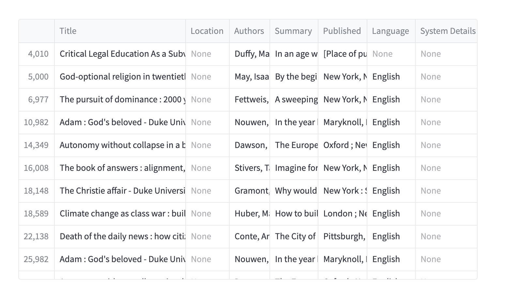

# Book Recommendation System
> #### _Iqra, Bryce, Bruno | Spring '23 | Duke AIPI 540 NLP Project_
&nbsp;

## Project Description
The goal of this project is to recommend books from a particular library using a prompt by the user.
The user then can decide to either checkout the book from that library or find online resource for it. The idea is to find books as easily as one wants depending on what a user is feeling like reading.
For example, a user would submit the following prompt;
`Looking for a book that explores the changing role of religion in the 20th century. Specifically, how certain religious groups redefined what it meant to be religious and allowed their members the choice of what kind of God to believe in, or the option to not believe in God at all.
`
And the result will contain title, location, and other important information of matching books from the library.

## Why libraries instead of online resources?
Some people like the smell of books or just try to relax and read paper based books. This is why we are targeting a source to keep the content limited and available to checkout.

## Data Sources
We scraped data from Duke libraries system and Durham public libraries. The most important field from the scraped data is summary of a book which is used to decide recommendation of that specific book.

### Duke Libraries

https://find.library.duke.edu/?f%5Bresource_type_f%5D%5B%5D=Book&utm_campaign=dul&utm_content=search_find_portal_link&utm_medium=referral&utm_source=library.duke.edu

### Durham County Library

We scraped approximately 25,000 books from the durham county library. This is less than a quarter of all the books they have on their website, but due to computational and time restraints, it was not worthwhile to scrape them all. The code for scraping the books can be found in `scripts/dpl_scrape_data.py` and the data in `data/dpl_book_data.tsv`. The link to the data that was scraped can be found [here](https://durhamcounty.bibliocommons.com/v2/search?custom_edit=false&query=isolanguage%3A%22eng%22%20audience%3A%22adult%22%20formatcode%3A(BK%20)&searchType=bl&suppress=true).

## Model Training and Evaluation

### Non-Deep Learning methods

#### **Keyword Matching - Bag-of-Words approach**
It takes in a prompt and a collection of books, and checks whether each book summary contains all the relevant keywords in the prompt. It does this by using a technique called CountVectorizer to convert the prompt and each book summary into a vector of word counts. Then it compares the word count vectors to check if all the relevant keywords from the prompt are present in each book summary. If a book summary contains all the relevant keywords, then the function sets the keywords_match column for that book to True.

#### **Cosine Similarity - TF-IDF technique**
It takes in a prompt and a collection of books, and calculates the cosine similarity between the prompt and each book summary. It does this by using a technique called TfidfVectorizer to convert the prompt and each book summary into a vector of TF-IDF scores. Then it calculates the cosine similarity between the prompt vector and each book vector using the cosine_similarity function. The function then sets the cosine_similarity column for each book to the cosine similarity score between the prompt and the book summary.

## References
